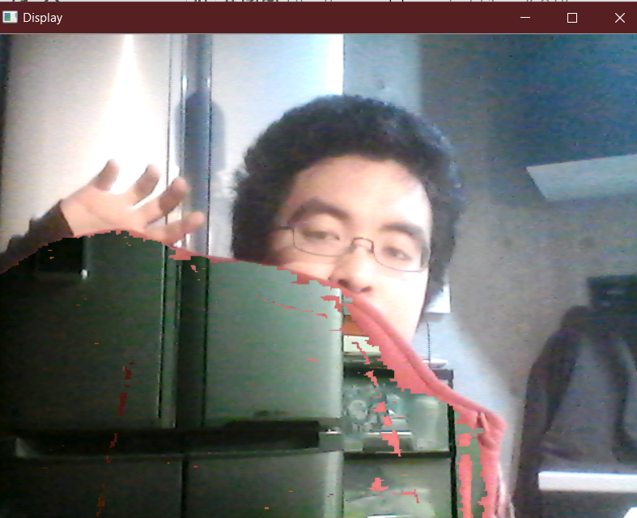

# Invisibiulity cloak project.
I try to recreate a very simple version of an invisibility cloak famous in Harry Potter via open cv's library. It extracts the HSV image of the camera, detects red, and pastes the background on top of it so it looks like the user is wearing an invisibility cloak.

by Jiro Mizuno

## Usage
1. Go to terminal, go to the repository folder and then type: `Python.exe cloak.py`

2. Make sure you are not in the initial camera frame. That will form the background image. 

3. Press `ESC` key on the keyboard to exit.

## Before

## After with a redsweatshirt

